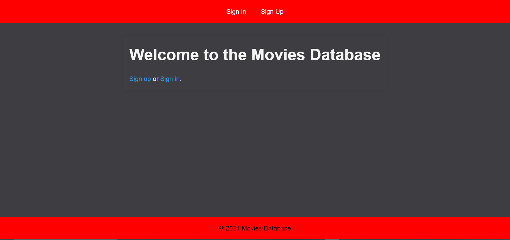
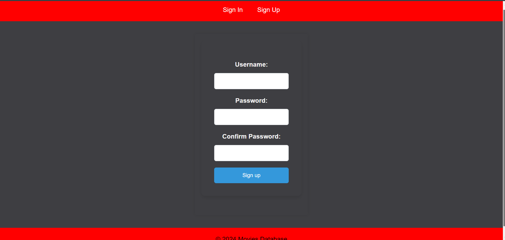
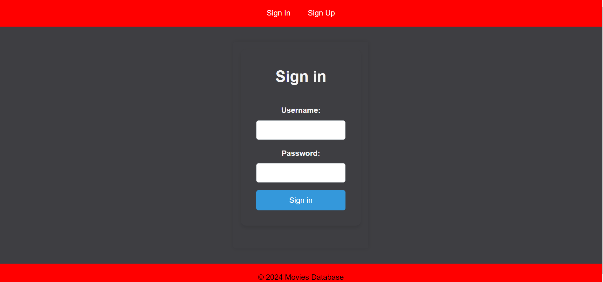
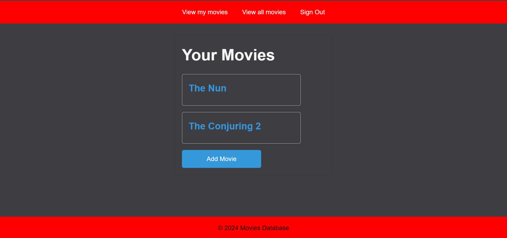
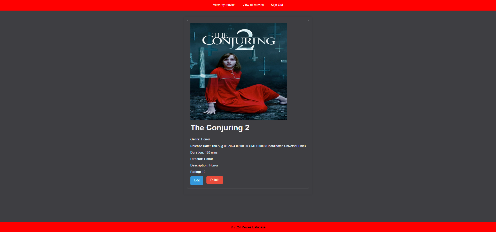
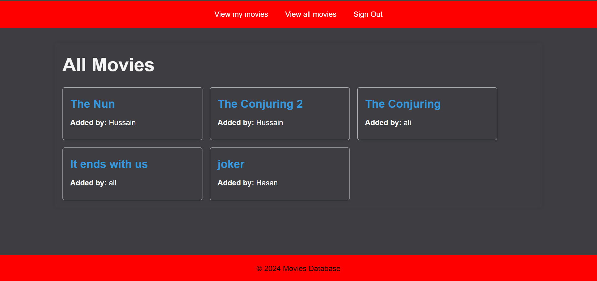

# Movies database application

Date: 1/8/2024

[Movies app](https://github.com/twix0217/movies-project.git)

## **Description**
**Movies database app, is an application that is developed in order to let the user add a list of movies along with the description of each movie(movie name, duration, release date, image, director, description, and rating), after adding the list of the movies, other users can view the list of movies added by each user along with the name of the user.**

## **How to use**

1. Sign up or Sign in from the home page.
2. Press on add movie after signing in.
3. Enter the details of the movie and then add the movie.
4. Then you can see the movie you added along with it's details.
5. You can also view the added movies of all the users by pressing on the view all movies in the navigation bar.

## Technologies used
* ejs
* CSS
* javaScript
* node.js
* express.js

## Screenshots

## Future Updates
1. Add search bar in the app.
2. Add a review field.

## Credits
* MDN Website
* w3schools website
* chatGPT
* Labs
* Lectures
  
